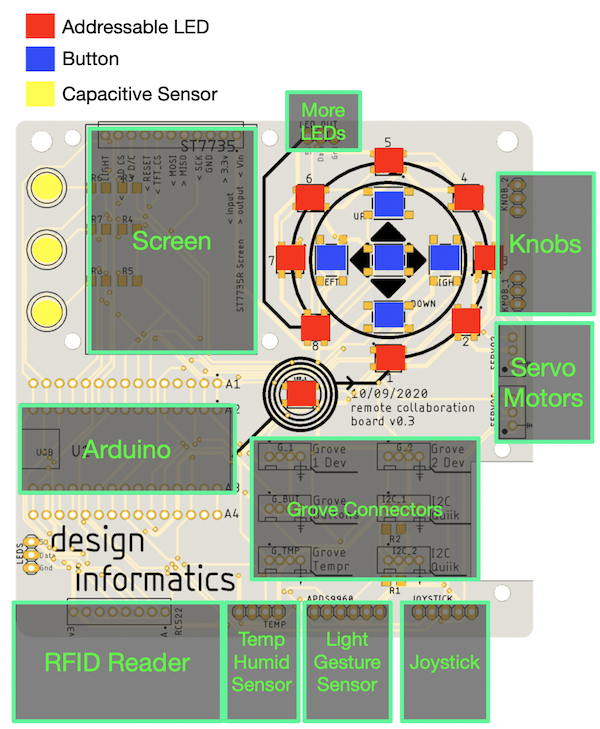
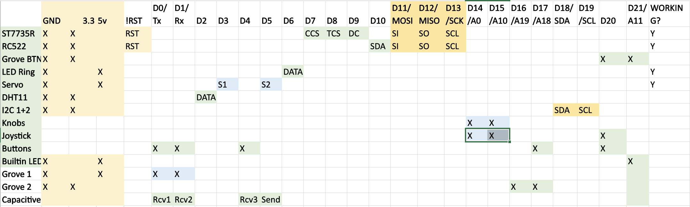

# Design Informatics PCB Library

This is a library to make it easy to use the features of the Design Informatics PCB.

## Block Diagram

The main features of the board are here:

## Features

* **Screen** - the board has a socket for a [1.44" TFT Screen](https://www.adafruit.com/product/2088), so you can add a display to your projects. This uses the [Adafruit_GFX libaray](https://learn.adafruit.com/adafruit-gfx-graphics-library), so it's easy to do text and graphics
* **LEDs** - there are 9 addressable LEDs on the board - one near the Arduino, and 8 arranged in a circle. These are WS2812Bs, which you can talk to using the [Adafruit NeoPixel Library](https://learn.adafruit.com/adafruit-neopixel-uberguide/arduino-library-use). There's also a socket to plug more LEDs into this chain, and another socket attached to a different pin for another set of LEDs.
* **Buttons** - there are 5 buttons in a cross - up, down, left, right and one in the middle.
* **Knobs and Joystick** - the little 5 pin joysticks plug in to a socket at the bottom, or you can plug  3 pin potentiometers in at the side
* **Grove Connectors** - there are 6 grove connectors. One for the temp sensor, one for the buttons, two general ones, and two that are set up for [QUIIK](https://www.sparkfun.com/qwiic#products) boards, so you can plug in lots of different fancy sensors quickly
* **Light and Gesture** - a connector for the Proximity, Gesture and Color sensor found on the other arduino boards, the [APDS9960](https://learn.adafruit.com/adafruit-apds9960-breakout).
* **Capacitive Electrodes** - at the top left of the board, there are some hidden capacitive electrodes. These work like buttons, but also sense when you're nearby using the [Capacitive Sensing](https://playground.arduino.cc/Main/CapacitiveSensor/) library.

## Note on 5V Pin

The Arduino Nano 33 IoT `5v` pin is not connected by default. For components that draw power from the `5v` pin you must either bridge the tags on the underside of the Arduino or bridge the `VIN` pin to the `5v` pin.

## Code

To try an make the learning curve a bit easier, the library sets up all of the devices connected to the board (and on the Arduino) and gives you objects that represent them. You get:

 **TODO: Add in all the setup info from DI.h**

 There are also examples that show how this works in practice:
 * ScreenTest makes sure your screen is working
 * LED_Demo will make all the lights flash
 * Everything tries to do everything at once - screen, RFID reader, joystick, buttons, LEDs, Temperature/Humidity, extra LEDs etc.
 * CapacitiveSensors shows the capacitive sensing using the LEDs
 * AccelerometerToLEDs and AccelerometerToScreen both show the Arduino's built in accelerometer, on the LEDs and the screen respectively

## Connections

Connections for the various ports and functions

All Grove connectors have the ground (black wire) on the right hand side of the board.

## Objects and use

| Thing | Variable | Connections | Library / Notes |
| ----- | -------- | ----------- | ------- |
| Screen | `SCREEN` (no variable created for the SD card reader yet, use example sketches)| D7 - card reader enable, D8 - screen enable, D9 - DC (MOSI,MISO,SCK standard) | [Adafruit_GFX libaray](https://learn.adafruit.com/adafruit-gfx-graphics-library)|
| RFID Reader - MFRC522 chip | `RFID` | D10 - SDA (MOSI,MISO,SCK standard) | [MFRC522](https://github.com/miguelbalboa/rfid) |
| Built in LEDs | `LEDS` | D21 - Data | [Adafruit NeoPixel Library](https://learn.adafruit.com/adafruit-neopixel-uberguide/arduino-library-use) |
| Extra LEDs | (no variable setup yet, use the example sketches, set output to pin 6) | D6 - Data | [Adafruit NeoPixel Library](https://learn.adafruit.com/adafruit-neopixel-uberguide/arduino-library-use) |
| Buttons | `BUTTON_UP`, `BUTTON_LEFT`, `BUTTON_CENT`, `BUTTON_RIGHT`, `BUTTON_DOWN` | D1 - UP, D17 - LEFT, D20 - CENT, D0 - Right, D4 - Down | [Bounce 2](https://github.com/thomasfredericks/Bounce2) (can read the buttons without the library, but it helps you to look for changes and just react to presses). Start with `startButtons()`, update in the loop with `updateButtons()` |
| Grove Buttons | | D20 - A, D21 - B | [Bounce 2](https://github.com/thomasfredericks/Bounce2) One button is twinned with the CENTRE button on the board, the other shares the builtin LED pin, so it'll stop the LEDs changing when you press it.  |
| DHT11 / Grove Temp Sensor | `TEMP_SENSOR`, stores results in `CURRENT_TEMP`, `CURRENT_HUMIDITY` | D2 | [DHT Sensor Library](https://github.com/adafruit/DHT-sensor-library). Start with `startTemperature()`, update each loop with `updateTemperature()`. The Grove sensor is connected the same as the 4 pin TEMP socket.|
| Joystick [example link](https://www.banggood.com/PS2-Game-Joystick-Push-Button-Switch-Sensor-Module-p-76465.html) | Values stored in `JOYSTICK_X` and `JOYSTICK_Y` | A0 - X, A1 - Y, D20 - Click | Call `updateKnobs()` to read the joystick, otherwise `analogRead()` for x and y, Bounce for button. |
| Grove Sensors | (not setup yet) | D0, D1 - Grove 1; A19,A18 - Grove 2; Quiik sockets are connected to the I2C bus | |
| Capacitive Electrodes | `CAPACITIVE_TOP`,`CAPACITIVE_MIDDLE`,`CAPACITIVE_BOTTOM`, values stored in `CAP_VALUE_TOP`, `CAP_VALUE_MIDDLE`, `CAP_VALUE_BOTTOM` | D5 - Return pin, D1 - top, D0 - middle, D4 - bottom | [Capacitive Sensing](https://playground.arduino.cc/Main/CapacitiveSensor/) library; call `updateCapacitiveSensors()` each loop to update values |
